<p align="center">
  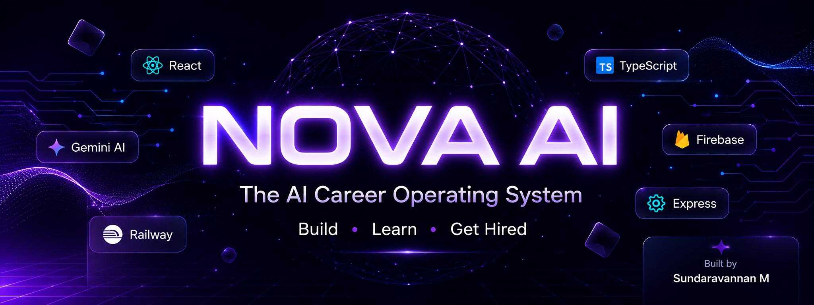
</p>

<h1 align="center">🚀 NOVA AI</h1>

<p align="center">
<b>The AI Career Operating System</b><br>
Build • Learn • Get Hired
</p>

<p align="center">
  
  
  
  
  
  
  
</p>

<p align="center">

🌐 <a href="https://nova-ai-production-016f.up.railway.app/">Live Demo</a> •
📂 <a href="https://github.com/Sundar-tech11/Nova-ai">Repository</a>

</p>

---

# 📖 About NOVA AI

**NOVA AI** is a modern AI-powered career operating system designed to help students and professionals accelerate their careers using Google's **Gemini 2.5 Flash AI**.

Instead of relying on multiple career websites, NOVA AI brings everything into one intelligent platform.

It assists users with:

- 🤖 AI Career Guidance
- 📄 ATS Resume Analysis
- 🎯 AI Interview Preparation
- 🛣 Personalized Career Roadmaps
- 💼 Portfolio Improvement
- 📊 Skill Tracking
- 🔐 Secure Authentication

Whether you're preparing for placements, internships, or your first software engineering job, NOVA AI acts as your personal AI career mentor.

---

# ✨ Features

## 🤖 Nova AI Career Coach

- AI-powered career assistant
- Personalized career guidance
- Technology recommendations
- Learning suggestions
- Powered by Google Gemini 2.5 Flash

---

## 📄 Resume Analyzer

- ATS Resume Score
- Resume Strength Analysis
- Weakness Detection
- Improvement Suggestions
- Resume Optimization Tips

---

## 🎯 Interview Preparation

- Technical Questions
- HR Questions
- AI Feedback
- Performance Score
- Model Answers
- Improvement Suggestions

---

## 🛣 Career Roadmap Generator

- Personalized Roadmaps
- Technology Recommendations
- Learning Timeline
- Skill Progression
- Career Planning

---

## 💼 Portfolio Builder

- Portfolio Review
- Project Suggestions
- Improvement Tips
- Professional Recommendations

---

## 📊 Skills Tracker

- Track Technical Skills
- Progress Visualization
- Learning Recommendations
- Growth Dashboard

---

## 🔐 Authentication

- Firebase Authentication
- Secure Login
- Secure Signup
- Protected Sessions

---

# 🛠 Tech Stack

| Category | Technology |
|-----------|------------|
| Frontend | React 19 |
| Language | TypeScript |
| Build Tool | Vite |
| Styling | Tailwind CSS |
| Icons | Lucide React |
| Backend | Express.js |
| Runtime | Node.js |
| AI | Google Gemini 2.5 Flash |
| Database | Firebase |
| Authentication | Firebase Auth |
| Deployment | Railway |

---

# 📂 Project Structure

```text
Nova-ai/
│
├── src/
│   ├── components/
│   ├── lib/
│   ├── App.tsx
│   └── main.tsx
│
├── api/
│
├── server.ts
├── server-db.ts
├── package.json
├── vite.config.ts
├── railway.toml
└── README.md
```

---

# 🚀 Installation

Clone the repository

```bash
git clone https://github.com/Sundar-tech11/Nova-ai.git
```

Navigate to the project

```bash
cd Nova-ai
```

Install dependencies

```bash
npm install
```

Create a `.env` file

```env
NODE_ENV=development

PORT=3000

GEMINI_API_KEY=YOUR_GEMINI_API_KEY
```

Run locally

```bash
npm run dev
```

Build Production

```bash
npm run build
```

Start Production Server

```bash
npm start
```

---

# 🌐 Live Demo

🔗 **Website**

https://nova-ai-production-016f.up.railway.app/

---

# 📸 Screenshots

# 📸 Dashboard Preview

## 🏠 Landing Page

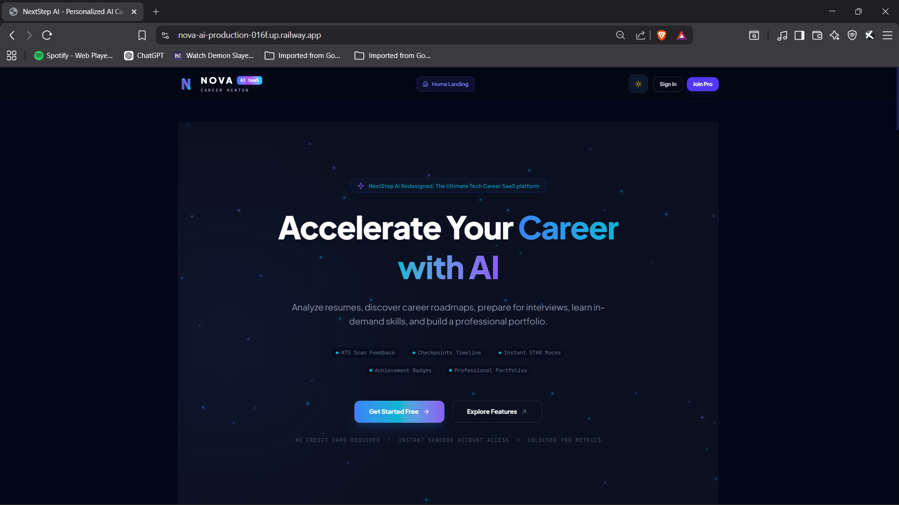

---

## 🔐 Authentication

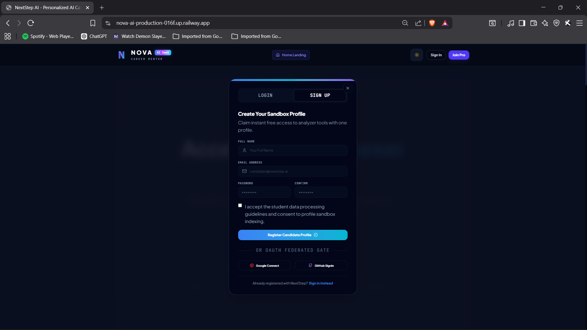

---

## 📊 Dashboard

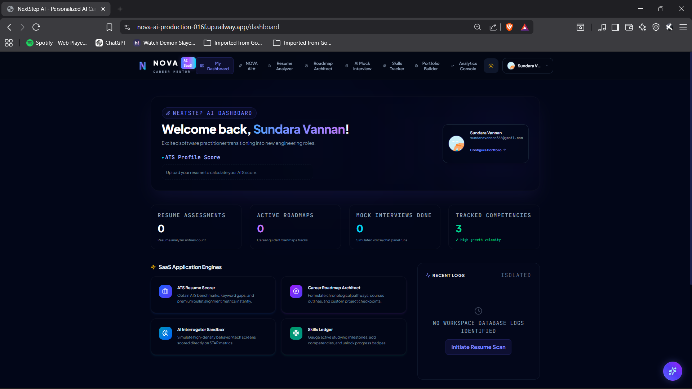

---

## 🤖 AI Career Coach

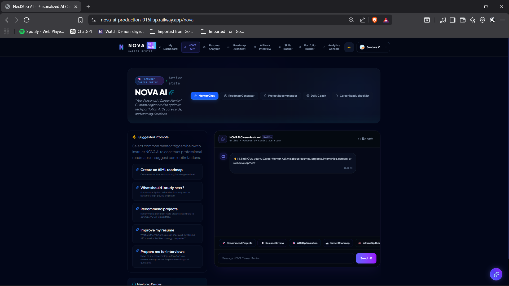

---

## 📄 Resume Analyzer

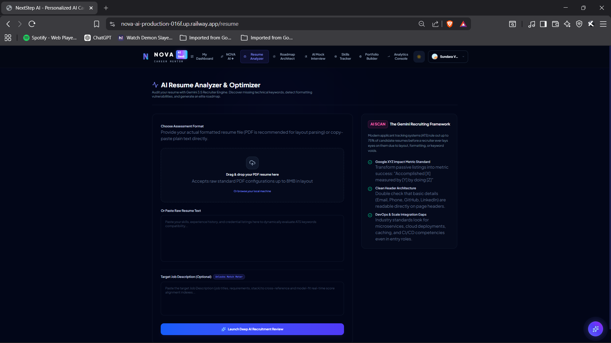

---

## 🛣️ Career Roadmap Generator

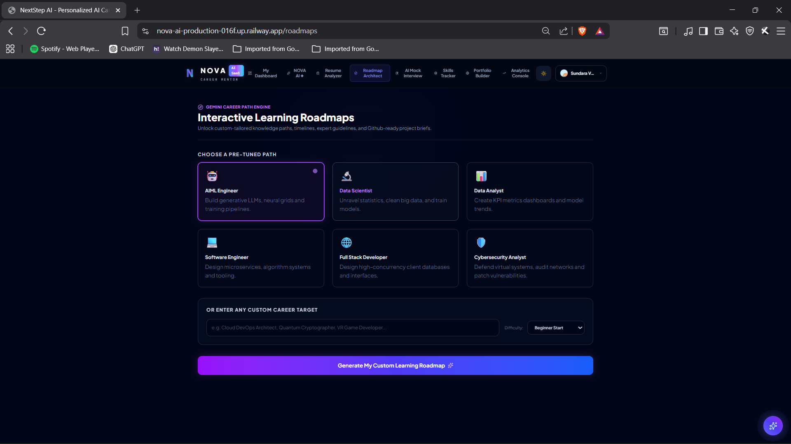

---

## 🎤 AI Mock Interview

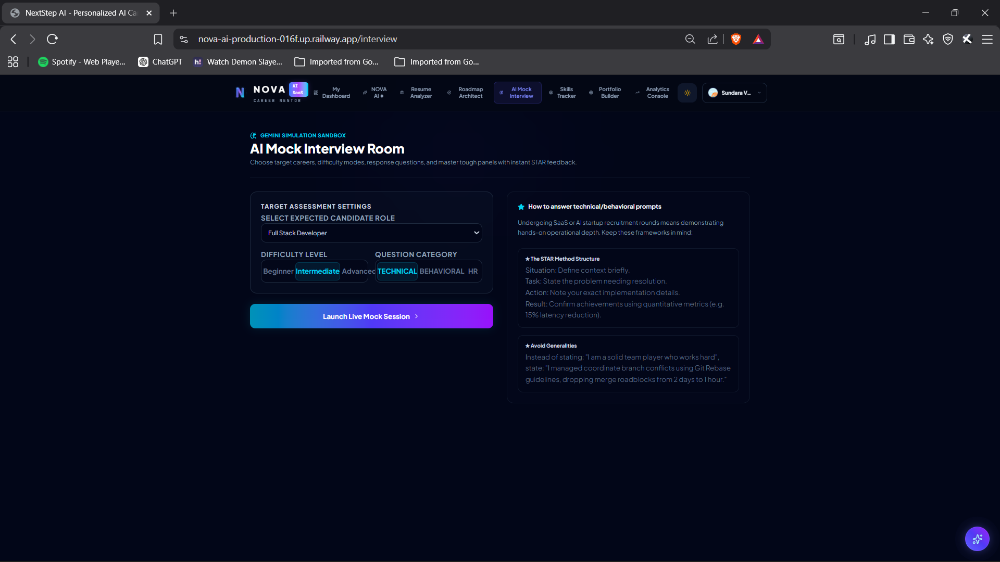

---

## 📈 Skills Tracker

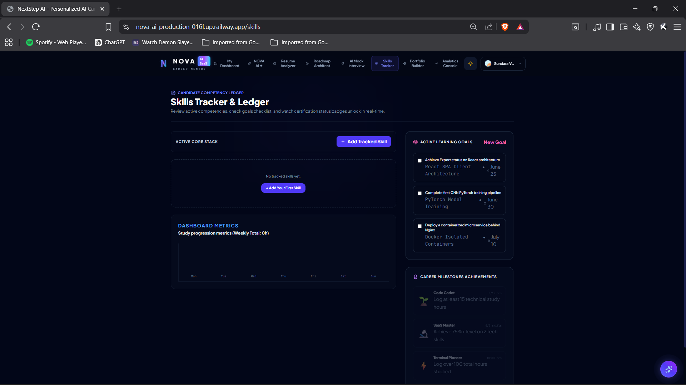

---

## 💼 Portfolio Builder

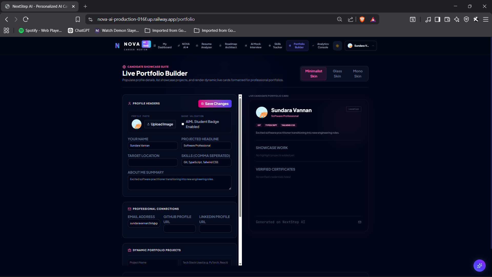

---

## 📊 Analytics Console

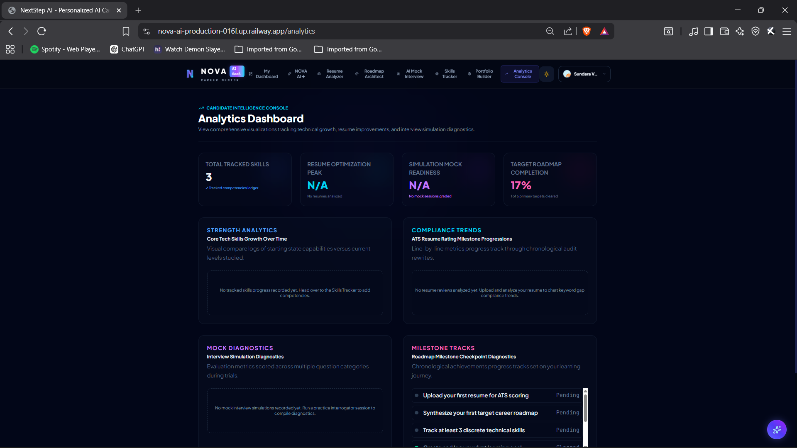


# 🎯 Future Enhancements

NOVA AI is continuously evolving. Planned features include:

- 🎤 AI Voice Mock Interviews
- 📹 Video Interview Practice
- 📄 PDF Resume Generator
- 📊 Advanced Analytics Dashboard
- 🏆 Gamified Learning System
- 🔔 Smart Notifications
- 📅 AI Study Planner
- 🤝 Community Discussion Forum
- 📈 Placement Preparation Tracker
- 🌙 Dark / Light Theme Toggle
- 📱 Progressive Web App (PWA)
- 📥 Resume Import from LinkedIn
- 🤖 Multi-AI Support (Gemini, OpenAI, Claude)

---

# ⚙️ Environment Variables

Create a `.env` file in the root directory.

```env
NODE_ENV=development

PORT=3000

GEMINI_API_KEY=YOUR_GEMINI_API_KEY
```

> Never commit your `.env` file to GitHub.

---

# 🚀 Deployment

The project is deployed on **Railway**.

### Build Command

```bash
npm run build
```

### Start Command

```bash
npm start
```

---

# 📈 Performance

✅ Optimized React Components

✅ Lazy Loading

✅ TypeScript

✅ Responsive UI

✅ Firebase Authentication

✅ Secure Backend APIs

✅ Railway Production Deployment

---

# 🔒 Security

- Secure Firebase Authentication
- Protected Backend APIs
- Environment Variables
- Password Hashing
- Session Management
- Protected Routes

---

# 🤝 Contributing

Contributions are always welcome.

1. Fork the repository

2. Create a new branch

```bash
git checkout -b feature/NewFeature
```

3. Commit changes

```bash
git commit -m "Added New Feature"
```

4. Push

```bash
git push origin feature/NewFeature
```

5. Open a Pull Request

---

# 📚 Learning Objectives

This project demonstrates:

- Full Stack Development
- REST APIs
- Authentication
- AI Integration
- Cloud Deployment
- Responsive Design
- TypeScript
- Modern React
- Express.js
- Firebase
- Railway Deployment

---

# 👨‍💻 Developer

## Sundaravannan

🎓 Artificial Intelligence & Machine Learning Student

Passionate about:

- Artificial Intelligence
- Machine Learning
- Full Stack Development
- Cloud Computing
- Software Engineering

### Connect with me

🐙 GitHub

https://github.com/Sundar-tech11

💼 LinkedIn

https://www.linkedin.com/in/YOUR-LINKEDIN

🌐 Live Project

https://nova-ai-production-016f.up.railway.app/

---

# ⭐ Support

If you found this project useful,

please consider giving it a ⭐ on GitHub.

It really motivates me to build more AI-powered open-source projects.

---

# 🙏 Acknowledgements

Special thanks to:

- Google Gemini AI
- Firebase
- Railway
- React
- TypeScript
- Vite
- Express.js
- Open Source Community

---

# 📄 License

This project is licensed under the **MIT License**.

© 2026 Sundaravannan

---

<div align="center">

## ⭐ If you like this project, don't forget to Star the Repository ⭐

Made with ❤️ by **Sundaravannan**

🚀 Keep Learning • Keep Building • Keep Growing

</div>